# Подробная инструкция по программе ProtocolOOT

**Версия программы:** 1.5 (смотрите **«Справка» → «О программе…»**).  
**Для кого:** для тех, кто впервые открывает программу или редко с ней работает.  
**Задача программы простыми словами:** взять данные о людях и программах обучения из таблицы Excel, вставить их в готовый бланк протокола Word и сохранить готовый файл (Word или PDF).

Краткая версия — в файле **ИНСТРУКЦИЯ_для_пользователя.md**.  
Ответы на отдельные вопросы — в **FAQ.md** (меню **«Справка» → «Справка и FAQ…»**).  
История изменений по версиям — **«Справка» → «Журнал доработок…»** или файл **ЖУРНАЛ_ДОРАБОТОК.md**.

---

## Содержание

1. Что вы видите на экране
2. Что положить в папку с программой до работы
3. Как запустить программу
4. Кнопка «Обновить базы с диска»
5. Рамка «Формирование протокола» — общее
6. Поле «Поиск»
7. Поле «Подразделение»
8. Список сотрудников
9. Поля «ФИО» и «Должность»
10. Блок «Программы обучения» (галочки)
11. Программа «В» и совмещения должностей
12. Технический протокол (отдельный режим)
13. Дата, № протокола, Оценка, Проверка знаний
14. Кнопки «Сформировать протокол» и соседние
15. Кнопки «Сохранить в DOCX», «PDF», «Предпросмотр»
16. Окно «Предпросмотр протокола»
17. Строка внизу окна (статус)
18. Меню «Администрирование» — все пункты
19. Окно «Настройки и данные» — по блокам
20. Окно «Приказ и комиссия»
21. Меню «Минтруд» — все пункты
22. Подстановка номеров из реестра Минтруда (пошагово)
23. Меню «Справка» — все пункты
24. Меню «Вид» — цветовая схема
25. Один полный пример: от начала до файла на диске
26. Частые ошибки и что делать

---

## 1. Что вы видите на экране

Представьте, что программа — это **конвейер**:

1. Слева вверху вы **подгружаете свежие данные** из Excel (кнопка обновления).
2. В рамке **«Формирование протокола»**: **слева** — список сотрудников, **справа** — ФИО, должность, реквизиты и **программы обучения** (блок программ — под реквизитами).
3. Ниже рамки — кнопки **«собрать»** документ и **«сохранить»** его в файл.
4. Вверху в полоске меню — **настройки**, **комиссия**, **Минтруд**, **справка**, **вид** (оформление).

Заголовок окна: **ProtocolOOT — протоколы ОТ**.

**Порядок полей в рамке** (сверху вниз): **поиск** (на всю ширину) → слева **список сотрудников**, справа **подразделение**, **ФИО**, **должность**, **программы** → **дата**, **номер**, **оценка**, **вид проверки**.

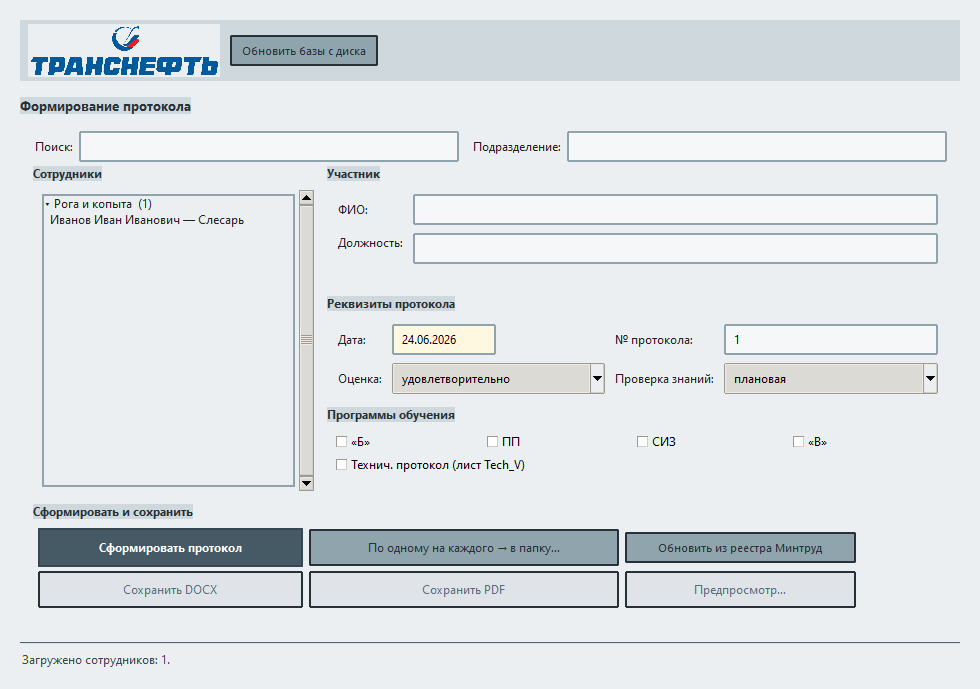

---

## 2. Что положить в папку с программой до работы

| Файл | Зачем он |
|------|----------|
| **Data_base.xlsx** или **Data_base.ods** | Список сотрудников (ФИО, должность, подразделение, СНИЛС). Часто там же лист **komission** — кандидаты в комиссию. |
| **Programs_base.xlsx** или **Programs_base.ods** | Или отдельно: листы программ **B**, **V_PROF**, **PP**, **SIZ**, **V**. Можно держать в том же Data_base. |
| **default_protocol.docx** или **.odt** | Бланк обычного протокола Word. Формат **.odt** (LibreOffice) программа при необходимости конвертирует в **.docx** — нужен установленный **LibreOffice**. |
| **default_protocol_tehnicheskiy.docx** или **.odt** | Бланк для технического протокола (если нужен). |
| **Шаблон_Минтруд_XSD_УМН.xlsx** | Если будете выгружать данные на сайт Минтруда. |

Программа **сама создаст** в своей папке:

- **protocols.db** — внутренний журнал и настройки;
- **Protokol/** — сюда часто сохраняют готовые протоколы;
- **Mintrud/** — выгрузки для портала;
- **protocol_errors_journal.txt** — текст ошибок (если что-то пошло не так).

**Важно:** если у вас программа в виде **одного файла** (ProtocolOOT или ProtocolOOT.exe), переносите **всю папку** целиком, а не только этот файл.

---

## 3. Как запустить программу

**Способ 1 — готовая программа:** дважды щёлкните **ProtocolOOT** (или **ProtocolOOT.exe**) в папке программы.

**Способ 2 — из исходников (для IT-специалиста):** запустите **запуск.bat** в папке проекта.

Окно может появиться не мгновенно — подождите несколько секунд.

---

## 4. Кнопка «Обновить базы с диска»

**Где:** самая верхняя кнопка под логотипом, слева (см. рис. 1).

**Что делает:** заново читает с диска:

- файл со **списком сотрудников**;
- файл с **программами обучения** (листы B, V_PROF, PP, SIZ, V и др.).

**Когда нажимать:**

- только что открыли программу;
- вы **сохранили изменения в Excel** (добавили человека, поправили должность);
- список сотрудников пустой или «старый».

**Горячая клавиша:** **F5** — то же самое.

**Если не нажать:** программа покажет то, что запомнила в прошлый раз. Новые строки из Excel не появятся.

**Частая ошибка:** Excel открыт на этом файе и не даёт его прочитать — закройте файл в Excel, потом снова **F5**.

---

## 5. Рамка «Формирование протокола» — общее

Это **главная рамка** по центру окна. Здесь вы отвечаете на вопросы:

- *Кого* вносим в протокол?
- *По каким программам* проверяли?
- *Когда* и *под каким номером*?
- *Какая оценка* и *плановая или внеплановая* проверка?

**Логичный порядок работы:**

1. Обновить базы (**F5**).
2. Найти и выбрать людей в списке (при необходимости — уточнить подразделение).
3. Поставить галочки программ; для **«В»** при совмещениях — пройти диалог (см. раздел 11).
4. Проверить дату и номер.
5. Нажать **«Сформировать протокол»**.
6. **«Сохранить в DOCX»** или **«Сохранить в PDF»**.

---

## 6. Поле «Поиск»

**Где:** первая строка внутри рамки «Формирование протокола».

**Что делает:** **сужает** длинный список сотрудников. Показывает только тех, у кого в данных есть введённый текст.

**Ищет по:** фамилии, имени, должности, подразделению, СНИЛС (что есть в Excel).

**Как пользоваться:**

1. Начните печатать фамилию, например `Иванов`.
2. Список ниже сузится.
3. Щёлкните нужную строку сотрудника.

**Совет:** не обязательно вводить полное ФИО — достаточно части слова.

**Горячая клавиша:** **Ctrl+F** — курсор сразу прыгнет в поле поиска.

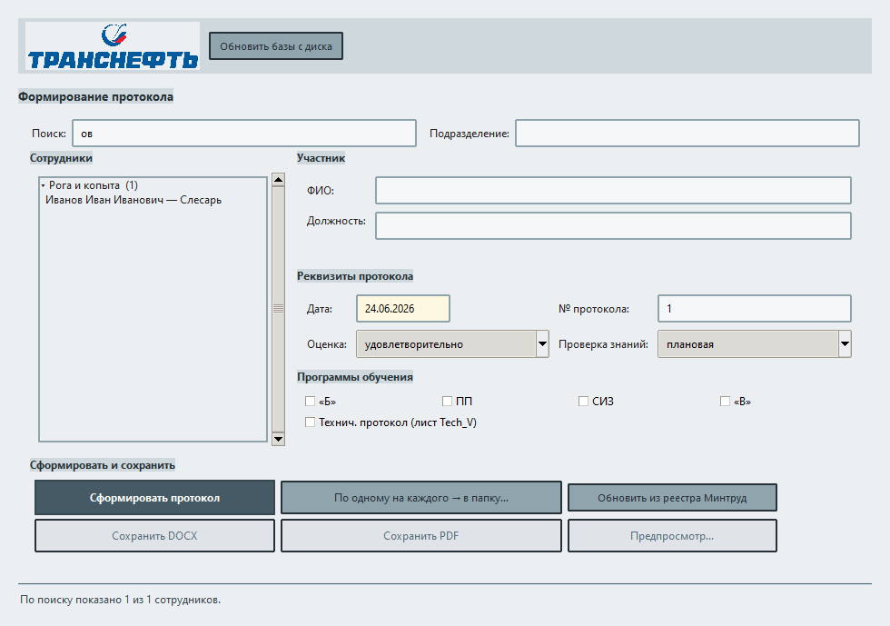

**Частая ошибка:** в поиске остался старый текст — список «пустой». Очистите поле поиска и снова увидите всех.

---

## 7. Поле «Подразделение»

**Где:** строка **над** списком сотрудников (не под ФИО).

**Что делает:** подставляет **подразделение сотрудника** из Excel при выборе в списке; можно **изменить вручную** для этого протокола.

**Не путать** с полем **«Подразделение (место проверки знаний)»** в окне **«Приказ и комиссия»** — оно идёт в бланк Word как место проведения проверки для всего протокола (см. раздел 20).

---

## 8. Список сотрудников

**Где:** большое поле со списком **под** полем «Подразделение».

**Что делает:** показывает людей из Excel, **сгруппированных по подразделениям**. Выбранные здесь попадут в протокол (в таблицу результатов и в текст).

### Группы по подразделениям

Строки вида **«▾ Название цеха (12)»** — это **заголовок группы**, а не сотрудник.

- Щёлкните по заголовку — группа **свернётся** или **развернётся**.
- В свёрнутой группе сотрудники не видны, пока снова не развернёте.

### Как выбрать одного человека

Щёлкните **один раз** по строке с ФИО — она подсветится.

### Как выбрать нескольких

- **Ctrl** — щёлкайте по строкам по одной (добавить/убрать из выбора).
- **Shift** — щёлкните первую строку, затем последнюю — выделится диапазон.

**Не выделяйте** строки-заголовки групп — только строки с людьми.

### Что происходит после выбора

Поля **ФИО**, **Должность**, **Подразделение** заполнятся сами из Excel (для **одного** выбранного; при нескольких — ФИО в поле может быть пустым, данные берутся из выбранных строк).

### Если списка нет совсем

1. Нажмите **F5**.
2. Откройте **«Администрирование» → «Настройки и данные…»** → **«Загрузить из Excel»** или **«Файл сотрудников…»**.
3. Проверьте, что в Excel есть лист с именем вроде **rabotnik**, **Работники**, **Сотрудники**.
4. Первая строка листа — **заголовки** (ФИО, должность…).

### Несколько строк Excel на одно ФИО

Если у одного человека в базе **несколько строк** (основная и совмещаемая должности), при выборе всех таких строк программа учтёт **обе должности** — особенно для программы **«В»** (см. раздел 11).

---

## 9. Поля «ФИО» и «Должность»

**Где:** под списком сотрудников.

### ФИО

**Когда заполняется само:** выбрали **одного** человека в списке.

**Когда вручную:** человека **нет в списке** — введите полностью: фамилия, имя, отчество.

### Должность

**Основная должность** для протокола:

- при **одном** выбранном — берётся из поля **«Должность»** на главном окне;
- при **нескольких** сотрудниках и программе **«В»** — для **каждого ФИО** своя основная должность задаётся в диалоге **«Совмещения — программы «В»»** (см. раздел 11).

**Совмещаемая должность** (вторая строка в Excel) учитывается для шапки и таблицы программы **«В»**, если отмечена в диалоге совмещений.

**Подсказка под полем:** программа показывает, **нашла ли** должность в справочнике профессий (лист V_PROF). Если совпадений несколько — появится список и кнопка **«Подставить»**.

**Важно для программы «Б» и реестра Минтруда:** должность в протоколе и в Excel должна **совпадать** с реестром для блока **«Б»** (см. раздел 21).

---

## 10. Блок «Программы обучения» (галочки)

**Где:** рамка с короткими подписями: **«Б»**, **ПП**, **СИЗ**, **«В»**.

| Галочка | О чём программа | Откуда программа берёт текст |
|---------|-----------------|------------------------------|
| **«Б»** | Базовая программа обучения по ОТ | Лист **B** и фрагменты по должности с листа **V_PROF** |
| **ПП** | Первая помощь | Листы **PP** и **V_PROF** |
| **СИЗ** | Средства индивидуальной защиты | Листы **SIZ** и **V_PROF** |
| **«В»** | Дополнительные программы по должности | Лист **V_PROF**; лист **V** — номера в гос. реестре |

**Как выбрать:** отметьте **все программы**, по которым реально проверяли этого человека (или группу).

**Обязательно для Word:** нужна **хотя бы одна** галочка.

**Подсказка:** наведите мышь на галочку — всплывёт короткое пояснение.

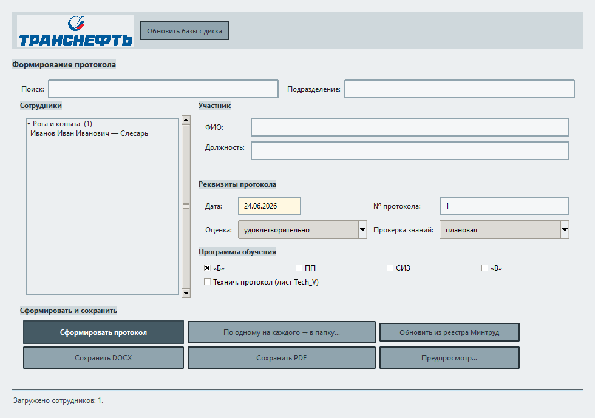

### Несколько человек и несколько программ

Если выбрано **несколько** сотрудников и **несколько** программ, в таблице протокола появятся **строки для каждого**.

---

## 11. Программа «В» и совмещения должностей

Диалог открывается **после нажатия «Сформировать протокол»**, если:

- отмечена галочка **«В»**;
- у **хотя бы одного** выбранного сотрудника **больше одной должности** (основная и совмещаемая из Excel или несколько строк с одним ФИО).

**Заголовок окна:** «Совмещения — программы «В»».

### Что настроить в диалоге

Для **каждого ФИО** отдельно:

| Элемент | Значение |
|---------|----------|
| **Галочка** у должности | Учитывать эту должность в программах **«В»** |
| **«основная»** (кружок) | Какая должность попадёт в графу **«Должность»** протокола **для этого человека** |

**Обязательно:** у каждого сотрудника — **хотя бы одна** отмеченная должность и выбранная **основная** среди отмеченных.

**Отмена** в диалоге — формирование протокола **прерывается**.

### Если диалог не появился

- не отмечена **«В»**; или
- у всех выбранных **только одна** должность — используется поле **«Должность»** на главном окне.

### Нумерация в таблице «В»

Если в ячейке справочника текст начинается с **«2.»**, **«3)»** и т.п., в протоколе сохранится **тот же номер**. Подробнее — **FAQ.md**.

---

## 12. Технический протокол (отдельный режим)

**Где:** галочка **«Технич. протокол (лист Tech_V)»** под программами (см. рис. 3).

**Это другой вид протокола** — не смешивайте его с обычным без необходимости.

### Когда включать

Проверка **технических** знаний по отдельному бланку и листу **Tech_V** в Excel.

### Что меняется

| Обычный протокол | Технический протокол |
|------------------|----------------------|
| Бланк **default_protocol.docx** | Бланк **default_protocol_tehnicheskiy.docx** (или свой) |
| Комиссия — вкладка «Охрана труда» | Комиссия — вкладка **«Технич. вопросы»** |
| Можно подставлять номера из реестра Минтруда | Реестр Минтруда **не используется** |
| Галочки Б, ПП, СИЗ, В | Выбор **одной строки** из списка **Tech_V** |

### Как работать

1. Поставьте галочку **«Технич. протокол»**.
2. Появится список **«Программа по листу Tech_V»** — выберите нужную строку.
3. При необходимости: **«Шаблон Word (тех.)…»** / **«Сброс тех. шаблона»**.
4. Заполните ФИО, дату, номер — как в обычном режиме.
5. **«Сформировать протокол»**.

После **F5** список Tech_V обновляется с диска.

**Размер окна (с 1.5):** при включении технического режима окно может **расшириться**, чтобы поместились дополнительные поля. Когда галочку **снимаете**, программа **восстанавливает** прежний размер окна (если вы его не меняли вручную после включения режима).

---

## 13. Дата, № протокола, Оценка, Проверка знаний

**Где:** нижняя часть рамки «Формирование протокола» (см. рис. 3).

### Дата

**Формат:** `ДД.ММ.ГГГГ`, например `09.06.2026`.  
Можно `ДД.ММ.ГГ` — программа поймёт.

**Зачем:** дата в шапке протокола; из неё же берётся **месяц и год** для номера (вид `5-06-2026` — номер-месяц-год).

### № протокола

**Число**, которое вы ведёте по журналу (1, 2, 3…).

Программа **запоминает** последний номер и подставит при следующем запуске.

### Оценка

- **удовлетворительно**
- **неудовлетворительно**

Попадает в таблицу результатов в Word.

### Проверка знаний

- **плановая**
- **внеплановая**

Тоже для таблицы в протоколе.

---

## 14. Кнопки «Сформировать протокол» и соседние

**Где:** под полями даты и оценки (см. рис. 3).

### «Сформировать протокол»

**Главная кнопка.** Она:

1. При программе **«В»** и совмещениях — открывает диалог (раздел 11), если нужно.
2. Собирает документ Word по бланку.
3. Открывает окно **«Предпросмотр»** (упрощённый текст).
4. Записывает сведения в **журнал** (полный текст в журнал **не сохраняется** — только ФИО, дата, номер и т.п.).
5. **Включает** кнопки «Сохранить в DOCX», «Сохранить в PDF», «Предпросмотр».

**До нажатия** сохранить файл нельзя — сначала нужно сформировать.

**Если ошибка:** прочитайте сообщение на экране; при необходимости файл **protocol_errors_journal.txt** в папке программы.

### «По одному на каждого → в папку…»

**Только для Word.** Если выбрано **несколько** сотрудников:

- программа сделает **отдельный файл Word на каждого**;
- номера протоколов **увеличиваются по порядку** (5, 6, 7… от числа в поле «№ протокола»);
- каждый сохранённый файл **можно сразу редактировать в Word**.

### «Обновить протокол из реестра Минтруда»

**Когда:** вы уже сформировали протокол, потом скачали с сайта **новый** файл «Реестр обученных» с регистрационными номерами.

**Что делает:** пересобирает протокол **с теми же** ФИО, датой, программами, но **подставляет номера из реестра** в таблицу.

**Не работает** в режиме **технического** протокола.

Сначала укажите файл реестра: **«Минтруд» → «Файл реестра обученных»** (см. **раздел 22**).

---

## 15. Кнопки «Сохранить в DOCX», «PDF», «Предпросмотр»

**Серые (неактивные)?** Сначала нажмите **«Сформировать протокол»**.

### «Сохранить в DOCX»

Сохраняет документ **Word**.  
Обычно предлагается папка **Protokol** рядом с программой.

Имя файла часто строится из номера, даты и фамилии.

**Редактирование:** готовый протокол сохраняется **без защиты** — его можно править в Word сразу после сохранения.

### «Сохранить в PDF»

Сохраняет **PDF**.

**На Windows «как в Word»:** нужен установленный **Microsoft Word**.

**Если Word нет:** может сохраниться **упрощённый** PDF из текста предпросмотра (таблица может выглядеть проще).

### «Предпросмотр…»

Снова открывает окно с текстом **последнего** сформированного протокола (если вы его закрыли).

---

## 16. Окно «Предпросмотр протокола»

**Зачем:** посмотреть, **что получилось**, до сохранения в файл.

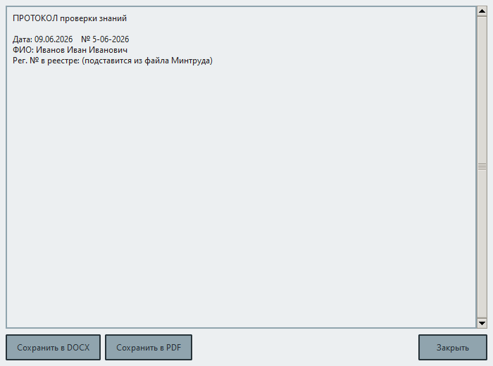

**Что там есть:**

- большое текстовое поле (это **упрощённый** вид, не полностью как в Word);
- те же кнопки **сохранить Word / PDF**;
- можно закрыть крестиком — на главном окне протокол **не пропадёт**, пока вы не сформируете новый.

**Важно:** окончательный вид таблиц и шрифтов — в сохранённом **файле Word**, откройте его в Word.

---

## 17. Строка внизу окна (статус)

Серая подпись внизу, например:

- сколько сотрудников **загружено** всего;
- сколько **показано** при текущем поиске.

Если «показано 0 из 150» — проверьте **поиск** или нажмите **F5**.

---

## 18. Меню «Администрирование» — все пункты

**Где:** верхняя полоска окна → **«Администрирование»**.

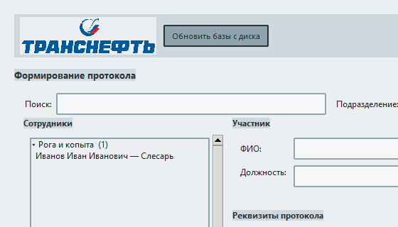

| № | Пункт меню | Простыми словами |
|---|------------|------------------|
| 1 | **Настройки и данные…** | Где лежат Excel, бланк Word, файл реестра Минтруда, журнал |
| 2 | **Приказ и комиссия…** | Приказ, место проверки, председатель и члены комиссии |
| 3 | **Выгрузка шаблонов восстановления…** | Скопировать «запасные» пустые файлы на флешку или другой диск |

### Пункт 1 — «Настройки и данные…»

Открывает окно настроек (подробно — **раздел 19**). Сюда заходят, когда нужно:

- указать **другой** файл с сотрудниками или программами;
- выбрать **свой бланк** протокола Word;
- подключить **файл реестра обученных** с сайта Минтруда;
- открыть **журнал** уже сформированных протоколов.

### Пункт 2 — «Приказ и комиссия…»

Открывает окно состава комиссии (подробно — **раздел 20**). Заполняют **до** формирования протокола, если в бланке Word должны быть председатель и члены комиссии.

### Пункт 3 — «Выгрузка шаблонов восстановления…»

**Когда нужен:** если потерялись или испортились рабочие файлы (база журнала, Excel, бланки).

**Что делает:**

1. Спросит **папку**, куда положить копии.
2. Скопирует туда пустые «стартовые» файлы: базу журнала, образец Excel, бланки Word, инструкции.
3. Добавит текстовый файл **ВОССТАНОВЛЕНИЕ_ДАННЫХ.txt** с пояснением, что куда перенести.

**Важно:** это **не** резервная копия ваших готовых протоколов — только шаблоны для восстановления работы программы.

---

## 19. Окно «Настройки и данные» — по блокам

Откройте: **«Администрирование» → «Настройки и данные…»**.

Окно открывается **поверх главного** (пока оно открыто, работать с формой протокола нельзя). С **версии 1.5** поля сгруппированы во **вкладки**:

| Вкладка | Что внутри |
|---------|------------|
| **Файлы данных** | Excel сотрудников и программ, реестр обученных |
| **Шаблоны** | бланки Word, защита шаблонов, переменные |
| **Прочее** | журналы, дополнительные поля, **цветовая схема** (дублирует меню **«Вид»**) |

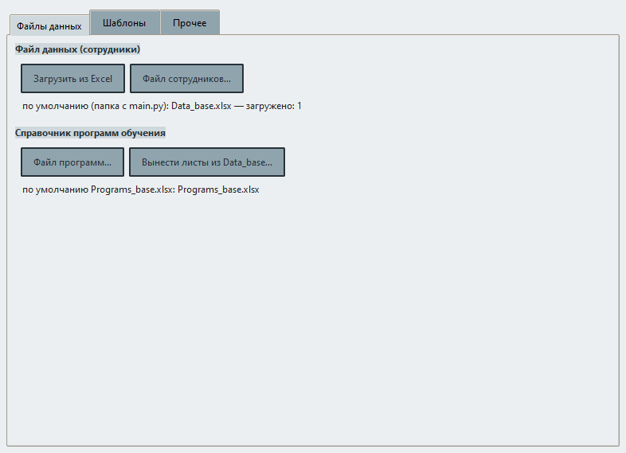

### Блок «Файл данных (сотрудники)»

| Кнопка | Действие |
|--------|----------|
| **Загрузить из Excel** | Прочитать сотрудников в список на главном окне |
| **Файл сотрудников…** | Указать **другой** файл вместо Data_base.xlsx |

Подпись внизу покажет, **какой файл** сейчас выбран.

**Лист komission** в том же файле — кандидаты в комиссию (см. раздел 20).

### Блок «Справочник программ обучения»

| Кнопка | Действие |
|--------|----------|
| **Файл программ…** | Указать **Programs_base.xlsx** |
| **Вынести листы из Data_base…** | Помочь разделить старый общий файл на два |

Если отдельного файла программ нет — программа читает листы B, V_PROF… из **того же** файла, что и сотрудники.

### Блок «Шаблон протокола»

| Кнопка / элемент | Действие |
|------------------|----------|
| **Выбрать шаблон** | Ваш бланк Word вместо стандартного |
| **Переменные шаблона** | Справка: **куда** программа подставляет номер, дату, таблицу, комиссию |

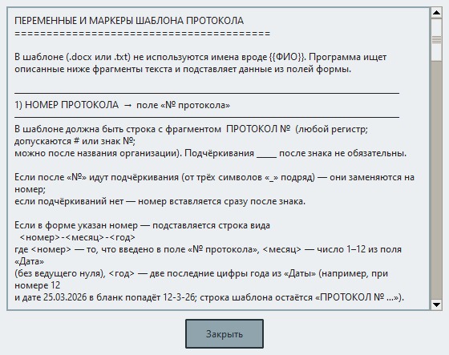

| Кнопка / элемент | Действие |
|------------------|----------|
| **Защита стандартных шаблонов в Word** (галочка) | Защищать **бланки** в папке программы от случайной правки |
| **Включить защиту шаблонов…** | Включить режим «только чтение» в Word на бланках |
| **Снять защиту (для правки)…** | Снять защиту с бланков, чтобы править их |
| **Папка шаблона…** | Открыть папку, где лежит текущий бланк |
| **Шаблон Word (тех.)…** / **Сброс тех. шаблона** | Бланк технического протокола |

**Важно:** **сформированные** протоколы при сохранении **не остаются защищёнными** — их можно править в Word сразу.

### Блок «Реестр обученных»

Файл **Excel с портала Минтруда** — выгрузка **«Реестр обученных»** после регистрации проверки на сайте. Именно из него программа берёт **регистрационные номера** для таблицы протокола.

| Кнопка | Действие |
|--------|----------|
| **Выбрать файл…** | Указать скачанный с портала файл Excel |
| **Сбросить** | Забыть путь к файлу (номера из реестра подставляться не будут) |

Под кнопками — подпись, **какой файл** сейчас подключён. Тот же файл можно указать через меню **«Минтруд» → «Файл реестра обученных»** (см. **раздел 22**).

### Блок «Дополнительно при заполнении»

| Поле | Зачем |
|------|-------|
| **Регистрационный номер** | Если в реестре номер **не нашёлся** — подставится этот (запасной) |
| **Доп. тема / строка для .txt** | Для текстового бланка, не для обычного Word |

### Кнопки журнала

| Кнопка | Зачем |
|--------|-------|
| **Журнал (охрана труда)…** | Список сформированных обычных протоколов |
| **Журнал (тех. протоколы)…** | То же для технических |
| **Очистить все журналы…** | Удалить историю (осторожно!) |

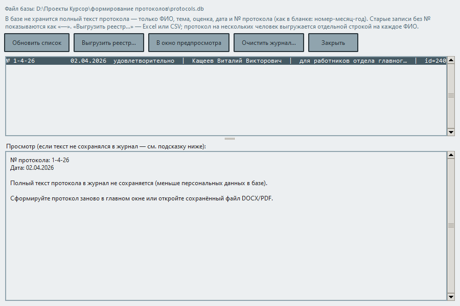

### Окно журнала (подробнее)

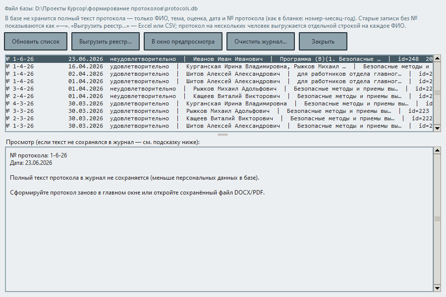

В журнале хранятся **не полный текст протокола**, а **ФИО, дата, оценка, № протокола, тема/программы**, время записи.

**С версии 1.5:** при повторном формировании того же протокола (тот же № и дата) запись **обновляется**, дубли в списке не показываются. Старые дубликаты удаляются из базы при запуске программы.

| Кнопка в журнале | Действие |
|------------------|----------|
| **Обновить список** | Перечитать записи |
| **Выгрузить реестр…** | Excel или CSV со списком сформированных протоколов |
| **В окно предпросмотра** | Если в записи был сохранён текст; иначе — сформируйте снова или откройте Word |
| **Очистить журнал** | Удалить записи этого вида |

---

## 20. Окно «Приказ и комиссия»

**«Администрирование» → «Приказ и комиссия…»**.

Две вкладки:

1. **Охрана труда** — обычный протокол.
2. **Технич. вопросы** — технический протокол.

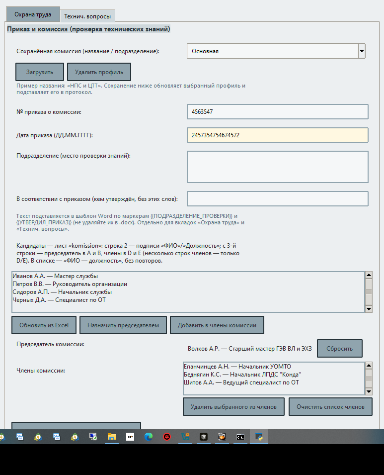

Данные **разные** — заполните обе, если пользуетесь обоими видами протоколов.

### Сохранённые профили комиссии (с 1.5)

Вверху окна — **название профиля** (подразделение), например «НПС и ЦТТ»:

| Элемент | Действие |
|---------|----------|
| Выпадающий список / поле названия | Выбор или ввод имени профиля |
| **Загрузить** | Подставить сохранённый приказ и состав |
| **Удалить профиль** | Удалить профиль из базы |
| **Сохранить приказ и состав в базу данных** | Создать или обновить профиль и активную комиссию для протокола |

Профили хранятся в `protocols.db`. Для вкладок «Охрана труда» и «Технич. вопросы» — **отдельные** списки.

### Поля приказа и шапки

| Поле | Что вписать |
|------|-------------|
| **№ приказа о комиссии** | Номер приказа, например `125` |
| **Дата приказа** | `ДД.ММ.ГГГГ` |
| **Подразделение (место проверки знаний)** | Текст для бланка Word: цех, участок, «для работников…» |
| **В соответствии с приказом (кем утверждён…)** | Кто утвердил приказ (фрагмент для шапки протокола) |

### Список кандидатов (середина окна)

Люди с листа **komission** в Excel.

| Кнопка | Действие |
|--------|----------|
| **Обновить список с Excel** | Перечитать лист komission |
| **Назначить председателем** | Выбранный кандидат → председатель |
| **Добавить в члены комиссии** | Выбранный кандидат → в члены |

### Председатель и члены

- **Председатель** — один человек.
- **Члены** — список; можно **удалить** выбранного или **очистить** весь список.

### Сохранить

Кнопка **«Сохранить приказ и состав в базу данных»** — запомнить состав и профиль (если указано название). **Пока не сохранили** — в протоколе могут быть старые данные.

**Вставка из буфера:** в полях работают **Ctrl+V** и **ПКМ → «Вставить»**.

---

## 21. Меню «Минтруд» — все пункты

**Где:** верхняя полоска → **«Минтруд»**.

| № | Пункт меню | Простыми словами |
|---|------------|------------------|
| 1 | **Реквизиты работодателя…** | ИНН и название организации для файла, который загружают на сайт |
| 2 | **Файл реестра обученных (.xlsx)…** | Подключить выгрузку с **номерами в реестре** после регистрации на портале |
| 3 | **Пересформировать протокол (номера реестра)…** | Пересобрать протокол с **новыми** номерами из файла реестра |
| 4 | **Шаблон для загрузки на сайт…** | Заполнить таблицу Excel (и файл xml) для **отправки данных на портал** |

**Важно:** пункты 2 и 3 **не работают** в режиме **«Технический протокол»** — там реестр Минтруда не используется.

### Пункт 1 — «Реквизиты работодателя…»

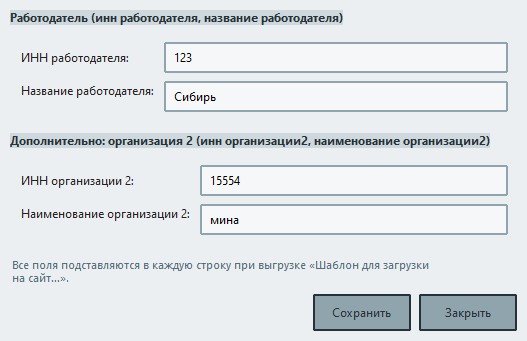

**Когда заполнять:** перед выгрузкой **«Шаблон для загрузки на сайт…»** (пункт 4).

**Что вписать:**

| Поле | Пример |
|------|--------|
| **ИНН работодателя** | 7701234567 |
| **Название работодателя** | Полное наименование организации |
| **ИНН организации 2** | Если в вашей схеме есть «вторая» организация (иначе можно оставить пустым) |
| **Наименование организации 2** | То же |

Нажмите **«Сохранить»** — данные запомнятся в программе.

### Пункт 2 — «Файл реестра обученных (.xlsx)…»

**Когда нужен:** после того как проверку зарегистрировали на портале Минтруда и **скачали** файл «Реестр обученных».

**Что делать:**

1. Нажмите пункт меню (или **«Выбрать файл…»** в настройках, блок «Реестр обученных»).
2. Укажите скачанный файл Excel на диске.
3. Программа проверит, что в таблице есть нужные столбцы (номер в реестре, ФИО, по возможности СНИЛС).
4. Если протокол на экране уже заполнен, может спросить: **пересформировать сейчас?** — нажмите **«Да»**, если хотите сразу подставить номера.

**Тот же файл** можно подключить в **«Настройки и данные»** → блок **«Реестр обученных»**.

### Пункт 3 — «Пересформировать протокол (номера реестра)…»

**То же самое**, что кнопка на главном окне **«Обновить протокол из реестра Минтруда»**:

**Когда нажимать:**

- скачали **новую** выгрузку реестра с портала;
- на экране **те же** сотрудники, программы и дата, что были при первом формировании;
- нужно **обновить только регистрационные номера** в таблице Word.

**Что произойдёт:** программа заново соберёт протокол, прочитает файл реестра и подставит номера. Откроется предпросмотр — проверьте и сохраните Word.

**Если файла реестра нет:** появится предупреждение — сначала выполните **пункт 2**.

### Пункт 4 — «Шаблон для загрузки на сайт…»

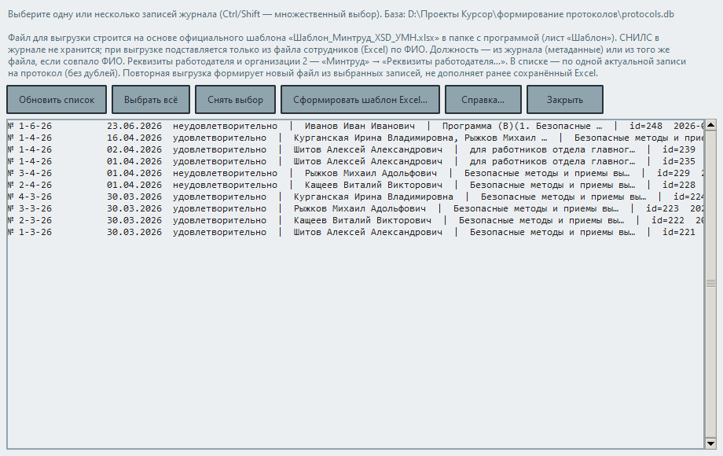

**Когда нужен:** вы **сформировали** протоколы в программе и хотите **передать сведения на сайт** Минтруда (до или после регистрации — по вашему процессу).

**Что делать:**

1. Откройте пункт меню.
2. В списке — **актуальные** записи журнала (без дублей). Выделите одну или несколько (**Ctrl**, **Shift**). Пустой список — сначала сформируйте протокол по охране труда.
3. Кнопки **«Выбрать все»** / **«Снять выбор»** — для удобства.
4. Нажмите **«Сформировать шаблон Excel…»**, укажите файл. Содержимое листа **заменяется** данными выбранных записей (старый файл не дополняется автоматически).
5. Программа заполнит таблицу **Шаблон_Минтруд_XSD_УМН.xlsx** и создаст рядом файл **.xml** с теми же данными.

Файлы обычно сохраняют в папку **Mintrud/** рядом с программой.

**Перед выгрузкой** заполните **реквизиты работодателя** (пункт 1). СНИЛС в журнал не хранится — программа подставит его из Excel с сотрудниками, если ФИО совпало.

Подробнее про работу на самом портале — **ИНСТРУКЦИЯ_оформление_протоколов_Минтруд.docx**.

---

## 22. Подстановка номеров из реестра Минтруда (пошагово)

Ниже — **полный порядок** для обычного протокола (не технического), когда нужны **регистрационные номера** в таблице Word.

### Этап А. До проверки (первичное формирование)

1. **F5** — обновить Excel.
2. Выбрать сотрудника, программы, дату, номер протокола.
3. **«Сформировать протокол»** → **«Сохранить в DOCX»**.
4. Провести проверку знаний, оформить документы.

На этом этапе в таблице могут быть **пустые** ячейки номера реестра — это нормально, если регистрация на портале ещё впереди.

### Этап Б. После регистрации на портале

1. Зайдите на **сайт Минтруда / АКОТ** (как принято у вашей организации).
2. Скачайте файл **«Реестр обученных»** в формате Excel.
3. В программе: **«Минтруд» → «Файл реестра обученных (.xlsx)…»** → укажите этот файл.
4. На главном окне снова выберите **тех же** сотрудников, **те же** программы, **ту же** дату и **тот же** № протокола, что были при первом формировании.
5. Нажмите **«Обновить протокол из реестра Минтруда»** (или пункт меню **«Пересформировать протокол…»**).
6. Проверьте предпросмотр → **«Сохранить в DOCX»** (можно перезаписать старый файл или сохранить новый).
7. Откройте Word — в таблице должны появиться **номера из реестра**.

### Как программа находит нужную строку в файле реестра

| Шаг | Что сравнивает |
|-----|----------------|
| 1 | **СНИЛС** (если есть и в Excel сотрудников, и в реестре) |
| 2 | **ФИО** + **номер протокола** + **программа** (Б, ПП, СИЗ, В) |
| 3 | Для программы **«Б»** при нескольких строках — ещё **должность** (должна совпадать) |

Если номер **не нашёлся:**

- проверьте СНИЛС и ФИО в Excel и в реестре;
- для «Б» — совпадение должности;
- в настройках можно указать **запасной регистрационный номер** (поле «Регистрационный номер (вручную…)»).

### Этап В. Отправка данных на портал

1. **«Минтруд» → «Реквизиты работодателя…»** — сохранить ИНН и название.
2. **«Минтруд» → «Шаблон для загрузки на сайт…»** — выбрать записи из журнала, выгрузить xlsx и xml.
3. Загрузить файлы на портал **по инструкции АКОТ** (шаги на сайте меняются — смотрите официальную справку).

### Если скачали обновлённый реестр

1. Снова **«Файл реестра обученных…»** → указать **новый** файл (или заменить старый на диске и обновить путь).
2. На главном окне восстановить те же поля → **«Обновить протокол из реестра Минтруда»**.

---

## 23. Меню «Справка» — все пункты

**Где:** верхняя полоска → **«Справка»**.

| № | Пункт | Зачем |
|---|-------|-------|
| 1 | **Справка и FAQ…** | Ответы на частые вопросы, можно искать по слову |
| 2 | **Горячие клавиши…** | Памятка по клавишам F5, Ctrl+F и др. |
| 3 | **Журнал доработок…** | Что изменилось в каждой версии (с 1.4) |
| 4 | **О программе…** | Версия, разработчик, e-mail для связи |

### Пункт 1 — «Справка и FAQ…»

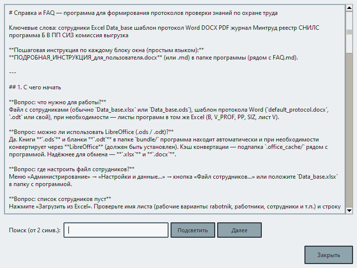

Большое окно с текстом подсказок. Вверху — **поле поиска**: введите слово (например, «Минтруд», «PDF», «комиссия») — список сузится.

### Пункт 2 — «Горячие клавиши…»

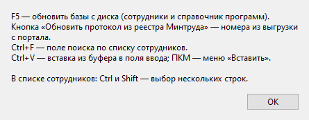

| Клавиша | Действие |
|---------|----------|
| **F5** | Обновить базы с диска |
| **Ctrl+F** | Перейти в поле «Поиск» по сотрудникам |
| **Ctrl+V** | Вставить текст в поле |
| **Ctrl** / **Shift** | Выбрать несколько строк в списке |

### Пункт 3 — «О программе…»

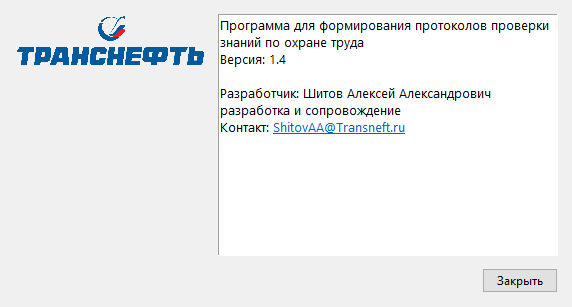

Показывает **номер версии** (сверяйте с этой инструкцией), имя разработчика и **адрес почты** — можно написать, если что-то не работает.

---

## 24. Меню «Вид» — цветовая схема

**Где:** верхняя полоска → **«Вид»**.

С **версии 1.5** можно выбрать **оформление** главного окна и диалогов:

| Пункт | Описание |
|-------|----------|
| **Светлая** | стандартная светлая тема |
| **Тёмная** | тёмный фон, светлый текст |
| **Синяя** | акцент синий |
| **Зелёная** | акцент зелёный |

Выбор **сохраняется** в базе настроек (`protocols.db`) и применяется при следующем запуске. Тот же выбор есть на вкладке **«Прочее»** в **«Настройки и данные…»**.

---

## 25. Один полный пример: от начала до файла на диске

**Задача:** протокол для Иванова И.И., программы «Б» и ПП, дата сегодня, номер 42.

1. Запустить программу.
2. **F5** — обновить базы.
3. В **поиске** набрать `Иванов`, в списке щёлкнуть **Иванов И.И.**
4. Проверить **Подразделение** и **Должность**.
5. Поставить галочки **«Б»** и **ПП**.
6. **Дата** — сегодняшняя. **№ протокола** — `42`.
7. **Оценка** — удовлетворительно. **Проверка** — плановая.
8. **«Приказ и комиссия»** — председатель, члены, место проверки → **Сохранить в базу** → закрыть.
9. **«Сформировать протокол»** — прочитать предпросмотр.
10. **«Сохранить в DOCX»** — папка **Protokol** → сохранить.
11. Открыть файл в Word — проверить таблицу и подписи.
12. При необходимости **«Сохранить в PDF»**.

Готово.

---

## 26. Частые ошибки и что делать

| Симптом | Что проверить |
|---------|----------------|
| Список сотрудников пуст | **F5**; путь к Excel в настройках; имя листа; закрыт ли Excel |
| Ошибка чтения **.ods** | Установлен ли **LibreOffice**; попробуйте сохранить книгу как **.xlsx** |
| Бланк **.odt** не подставляется | LibreOffice и путь к шаблону в настройках; допустим также **.docx** |
| После поиска «0 из N» | Очистите поле **Поиск** |
| «Нужна хотя бы одна программа» | Поставьте галочку **«Б»**, **ПП**, **СИЗ** или **«В»** |
| Диалог «Совмещения» — не даёт продолжить | У каждого ФИО отметьте должность и выберите **основную** |
| Таблица в Word пустая | В бланке есть нужные метки — см. **«Переменные шаблона»** в настройках |
| Номер из реестра не подставился | Указан файл реестра? Совпадают СНИЛС/ФИО/№ протокола? Для «Б» — должность? Те же программы на экране, что при регистрации? |
| «Сначала укажите файл реестра…» | **«Минтруд» → «Файл реестра обученных»** или блок в настройках |
| Реестр не работает в тех. протоколе | Для **технического** протокола реестр **не предусмотрен** — это нормально |
| Word не даёт править **бланк** | Это нормально — **«Снять защиту (для правки)…»** в настройках; **готовый протокол** не защищён |
| PDF «странный» | Установлен ли **Word**? Иначе сохранится упрощённый PDF |
| Ctrl+V не вставляет | Кликните в поле ввода; **ПКМ → Вставить**; перезапустите программу |
| Ошибка при сохранении Excel Минтруда | Файл **Шаблон_Минтруд_XSD_УМН.xlsx** в папке программы |
| После переноса программы «ничего не находит» | Копируйте **всю папку** сборки, не один файл |
| В журнале нет текста протокола | Так задумано — откройте сохранённый Word или сформируйте снова |

---

*Инструкция для программы ProtocolOOT, версия 1.5. При обновлении программы сверяйте пункты меню с экраном — в старых сборках названия могут отличаться.*
